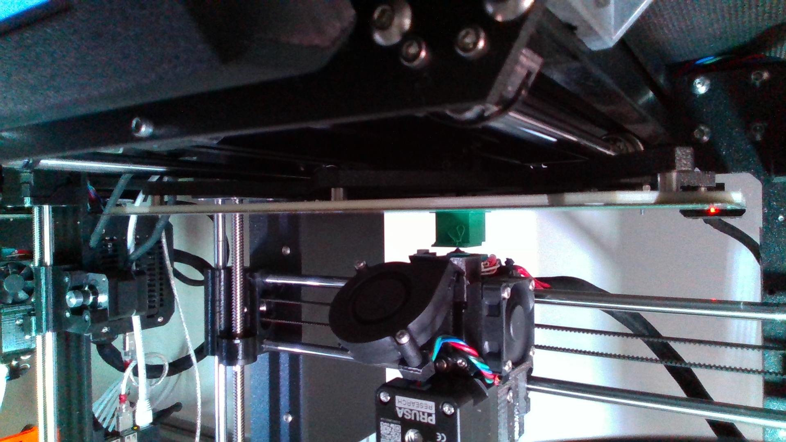
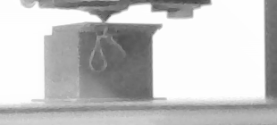
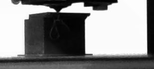
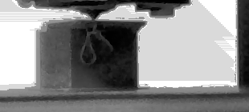
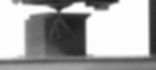
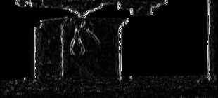
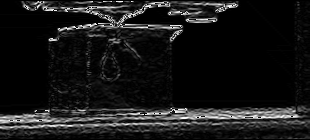

This repository is used to practice various image processing techniques.
The used image was taken during the printing process of a 3D-printer and shows the printing error "Layershift". 

## Original Image


## After preprocessing

Steps include cropping image to region of interest, trasfering RGB color to grayscale and rotation.


## Point operators

### Gamma operator
```python
PointOperators.apply_gamma_operator(gamma: float)
```
gamma = 0.5:



gamma = 2:




### Histogram equalization

```python
PointOperators.apply_histogram_equalization()
```



## Linear operator
### Gaussian average filter

```python
LinearOperators.apply_gaussian_avg_filter(kernel_size: list, sigma: int)
```

kernel_site = (9, 9), sigma = 3:



### Sobel Derivatives

```python
LinearOperators.apply_derivative(orientation: str)
```

Horizontal kernel 
```math
\begin{bmatrix}
    -1 & 0 & 1\\
    -2 & 0 & 2\\
    -1 & 0 & 2
\end{bmatrix}
```


Vertical kernel 
```math
\begin{bmatrix}
    -1 & -2 & 1\\
    0 & 0 & 0\\
    1 & 2 & 1
\end{bmatrix}
```
